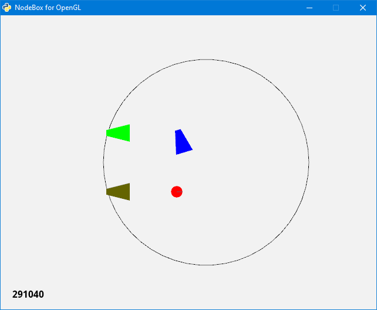

# NetGame: Local network virtual robot competitions for Python students

# NetGame: Віртуальні змагання роботів в локальній мережі для Python-студентів

*NetGame* призначений для організації через локальну мережу віртуальних змагань роботів, які повинні знайти круглий об’єкт і виштовхнути його за межі кола (рис.). Він використовує модуль socket, графічний пакет [NodeBox for OpenGL](https://cityinabottle.org/nodebox/) та пакет для симуляції 2D-фізики [Pymunk](https://www.pymunk.org).



## Установлення на локальній машині (для відлагодження клієнтської програми учасника):

1. Завантажити [Portable Python 2.7 with Nodebox for OpenGL 1.7 and Pymunk 5.7.0](https://drive.google.com/file/d/1c_g68dGEbqha1Zx2jabuIeFXcdDk5bfY/view?usp=sharing)
2. Завантажити [архів](https://github.com/vkopey/Pymunk_Nodebox_Examples/archive/refs/heads/main.zip)
3. Розпакувати архіви. Бажано в корінь диску D
4. Запустити сервер server.bat **Увага! Потенційно небезпечно! Див. примітку нижче**
5. За потреби модифікуйте код клієнта client.py
6. За допомогою інтерпретатора Python запустити client.py. Способи запуску:
  - Запуск звичайний:
  "d:\Portable\Portable Python-2.7.17\App\Python\python.exe" client.py
  - Запуск в інтерактивному режимі:
  "d:\Portable\Portable Python-2.7.17\App\Python\python.exe" -i client.py
  - Використання Python IDE (Pyzo, PyCharm, Visual Studio Code або іншого)

**Увага!** server.py використовує функцію eval() та команду exec, які можуть виконати довільний Python-код. Зловмисник може скористатись цим. Автор не несе відповідальності за можливі наслідки! У разі використання публічних мереж рекомендується запускати сервер в ізольованому середовищі.

## Приклад роботи в інтерактивному режимі:

```Python
>>> b
<__main__.Robot object at 0x0B218F50>
>>> b.setangle(5)
>>> b.insect()
False
>>> b.setvel(100)
>>>
```

## Правила змагань:

Дозволено:
1. Використовувати атрибути класу Robot
2. Створювати похідні класи класу Robot

Заборонено:
1. Змінювати клас Robot
2. Надсилати на сервер команди, яких немає в класі Robot
3. Керувати більше ніж одним об'єктом або чужими об'єктами на сервері
